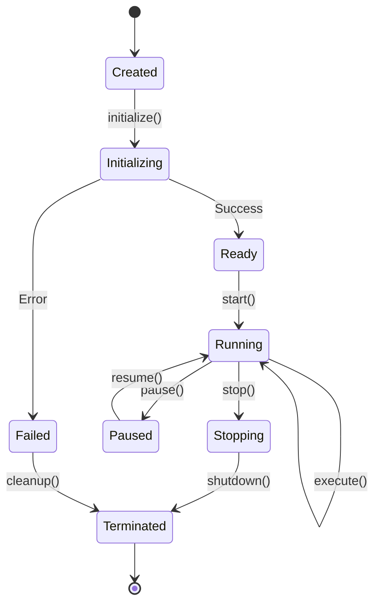

# PETRA Agent System Documentation

## Overview

The PETRA Agent System provides a framework for implementing autonomous, intelligent agents that monitor, analyze, and control industrial processes. Agents in PETRA are self-contained modules that can observe system state through the signal bus, make decisions based on configured logic or AI models, and take actions to optimize operations, ensure safety, or respond to anomalies.

## Table of Contents

1. [Core Concepts](#core-concepts)
2. [Agent Types](#agent-types)
3. [Agent Architecture](#agent-architecture)
4. [Implementation Guide](#implementation-guide)
5. [Agent Communication](#agent-communication)
6. [Configuration](#configuration)
7. [Security & Permissions](#security--permissions)
8. [Examples](#examples)
9. [Best Practices](#best-practices)
10. [Troubleshooting](#troubleshooting)

## Core Concepts

### What is a PETRA Agent?

A PETRA Agent is an autonomous software component that:
- **Observes**: Monitors signals and system state through the signal bus
- **Decides**: Processes information using logic, rules, or AI models
- **Acts**: Executes actions by writing to signals or triggering operations
- **Learns**: Optionally adapts behavior based on historical data (with ML features)

### Agent Characteristics

- **Autonomous**: Operates independently once configured
- **Reactive**: Responds to changes in system state
- **Proactive**: Can predict and prevent issues
- **Collaborative**: Communicates with other agents for coordinated actions
- **Resilient**: Handles failures gracefully and recovers automatically

## Agent Types

### 1. Monitoring Agents

Monitor system health, performance, and operational parameters.

```rust
pub trait MonitoringAgent: Agent {
    fn observe(&self, bus: &SignalBus) -> Vec<Observation>;
    fn analyze(&self, observations: &[Observation]) -> HealthStatus;
    fn alert(&self, status: &HealthStatus) -> Result<()>;
}
```

**Examples:**
- **Performance Monitor**: Tracks CPU, memory, and response times
- **Anomaly Detector**: Identifies unusual patterns in sensor data
- **Threshold Guardian**: Watches for values exceeding limits
- **Trend Analyzer**: Detects gradual degradation

### 2. Control Agents

Implement control logic for process automation.

```rust
pub trait ControlAgent: Agent {
    fn evaluate_conditions(&self, bus: &SignalBus) -> ControlDecision;
    fn execute_control(&self, decision: &ControlDecision, bus: &SignalBus) -> Result<()>;
    fn verify_execution(&self, bus: &SignalBus) -> Result<()>;
}
```

**Examples:**
- **PID Controller**: Maintains setpoints using PID algorithms
- **Sequence Controller**: Manages multi-step processes
- **Safety Controller**: Implements safety interlocks
- **Optimization Agent**: Adjusts parameters for efficiency

### 3. Predictive Agents

Use historical data and ML models for predictions.

```rust
#[cfg(feature = "ml-inference")]
pub trait PredictiveAgent: Agent {
    fn collect_features(&self, bus: &SignalBus) -> FeatureVector;
    fn predict(&self, features: &FeatureVector) -> Prediction;
    fn recommend_action(&self, prediction: &Prediction) -> Action;
}
```

**Examples:**
- **Failure Predictor**: Predicts equipment failures
- **Demand Forecaster**: Anticipates resource needs
- **Quality Predictor**: Estimates product quality
- **Maintenance Scheduler**: Optimizes maintenance timing

### 4. Integration Agents

Bridge PETRA with external systems.

```rust
pub trait IntegrationAgent: Agent {
    async fn sync_external(&self, bus: &SignalBus) -> Result<()>;
    fn transform_data(&self, external: ExternalData) -> Value;
    fn handle_external_event(&self, event: ExternalEvent) -> Result<()>;
}
```

**Examples:**
- **ERP Connector**: Syncs with enterprise systems
- **Cloud Agent**: Uploads data to cloud platforms
- **SCADA Bridge**: Interfaces with SCADA systems
- **API Gateway**: Exposes PETRA data via REST/GraphQL

### 5. Coordination Agents

Orchestrate multi-agent workflows.

```rust
pub trait CoordinationAgent: Agent {
    fn coordinate(&self, agents: &[Box<dyn Agent>]) -> CoordinationPlan;
    fn resolve_conflicts(&self, conflicts: &[AgentConflict]) -> Resolution;
    fn optimize_resources(&self, requests: &[ResourceRequest]) -> Allocation;
}
```

**Examples:**
- **Workflow Orchestrator**: Manages complex processes
- **Resource Allocator**: Distributes limited resources
- **Conflict Resolver**: Handles competing agent goals
- **Load Balancer**: Distributes work across agents

## Agent Architecture

### Core Agent Trait

All agents implement the base `Agent` trait:

```rust
#[async_trait]
pub trait Agent: Send + Sync {
    /// Unique identifier for this agent
    fn id(&self) -> &str;
    
    /// Agent category for organization
    fn category(&self) -> AgentCategory;
    
    /// Initialize the agent with configuration
    async fn initialize(&mut self, config: &AgentConfig) -> Result<()>;
    
    /// Main execution loop - called periodically
    async fn execute(&mut self, bus: &SignalBus) -> Result<()>;
    
    /// Graceful shutdown
    async fn shutdown(&mut self) -> Result<()>;
    
    /// Health check
    fn health_check(&self) -> HealthStatus;
    
    /// Get current state for monitoring
    fn state(&self) -> AgentState;
    
    /// Handle messages from other agents
    async fn handle_message(&mut self, msg: AgentMessage) -> Result<AgentResponse>;
}
```

### Agent Lifecycle



### Agent Manager

The `AgentManager` orchestrates all agents:

```rust
pub struct AgentManager {
    agents: HashMap<String, Box<dyn Agent>>,
    scheduler: AgentScheduler,
    message_broker: MessageBroker,
    resource_manager: ResourceManager,
    monitoring: AgentMonitoring,
}

impl AgentManager {
    pub async fn register_agent(&mut self, agent: Box<dyn Agent>) -> Result<()>;
    pub async fn start_agent(&mut self, agent_id: &str) -> Result<()>;
    pub async fn stop_agent(&mut self, agent_id: &str) -> Result<()>;
    pub async fn send_message(&self, to: &str, msg: AgentMessage) -> Result<AgentResponse>;
}
```

## Implementation Guide

### Step 1: Define Agent Structure

```rust
use petra::agents::{Agent, AgentConfig, AgentState, AgentCategory};
use petra::{SignalBus, Value, Result};

pub struct TemperatureControlAgent {
    id: String,
    config: TemperatureControlConfig,
    state: AgentState,
    last_reading: Option<f64>,
    control_output: f64,
}

#[derive(Deserialize)]
pub struct TemperatureControlConfig {
    pub setpoint: f64,
    pub sensor_signal: String,
    pub control_signal: String,
    pub kp: f64,
    pub ki: f64,
    pub kd: f64,
    pub scan_rate_ms: u64,
}
```

### Step 2: Implement Agent Trait

```rust
#[async_trait]
impl Agent for TemperatureControlAgent {
    fn id(&self) -> &str {
        &self.id
    }
    
    fn category(&self) -> AgentCategory {
        AgentCategory::Control
    }
    
    async fn initialize(&mut self, config: &AgentConfig) -> Result<()> {
        self.config = config.parse_config::<TemperatureControlConfig>()?;
        self.state = AgentState::Ready;
        Ok(())
    }
    
    async fn execute(&mut self, bus: &SignalBus) -> Result<()> {
        // Read current temperature
        let current_temp = bus.get_float(&self.config.sensor_signal)?;
        
        // Calculate control output using PID
        let error = self.config.setpoint - current_temp;
        self.control_output = self.calculate_pid(error, current_temp);
        
        // Write control output
        bus.set(&self.config.control_signal, Value::Float(self.control_output))?;
        
        // Update state
        self.last_reading = Some(current_temp);
        
        Ok(())
    }
    
    async fn shutdown(&mut self) -> Result<()> {
        // Set control output to safe state
        bus.set(&self.config.control_signal, Value::Float(0.0))?;
        self.state = AgentState::Terminated;
        Ok(())
    }
    
    fn health_check(&self) -> HealthStatus {
        if self.last_reading.is_some() {
            HealthStatus::Healthy
        } else {
            HealthStatus::Warning("No readings yet".to_string())
        }
    }
    
    fn state(&self) -> AgentState {
        self.state.clone()
    }
    
    async fn handle_message(&mut self, msg: AgentMessage) -> Result<AgentResponse> {
        match msg {
            AgentMessage::Query(query) => {
                // Handle queries about agent state
                Ok(AgentResponse::Data(self.get_diagnostics()))
            }
            AgentMessage::Command(cmd) => {
                // Handle commands like setpoint changes
                self.handle_command(cmd).await
            }
            _ => Ok(AgentResponse::NotHandled)
        }
    }
}
```

### Step 3: Register with Agent Manager

```rust
// In your main application or module initialization
let agent = Box::new(TemperatureControlAgent::new("temp_control_1"));
agent_manager.register_agent(agent).await?;
agent_manager.start_agent("temp_control_1").await?;
```

## Agent Communication

### Message Types

```rust
pub enum AgentMessage {
    /// Request data from agent
    Query(QueryRequest),
    
    /// Send command to agent
    Command(AgentCommand),
    
    /// Notify about event
    Notification(AgentNotification),
    
    /// Request coordination
    Coordination(CoordinationRequest),
    
    /// Share knowledge/learning
    Knowledge(KnowledgeUpdate),
}

pub enum AgentResponse {
    /// Return requested data
    Data(Value),
    
    /// Acknowledge command
    Acknowledged,
    
    /// Indicate error
    Error(String),
    
    /// Not handled by this agent
    NotHandled,
}
```

### Communication Patterns

#### 1. Direct Messaging
```rust
let response = agent_manager
    .send_message("temp_control_1", AgentMessage::Query(QueryRequest::Status))
    .await?;
```

#### 2. Publish-Subscribe
```rust
// Publisher agent
bus.publish("temperature.alerts", Event::HighTemperature(temp))?;

// Subscriber agent
impl Agent for AlertAgent {
    async fn initialize(&mut self, config: &AgentConfig) -> Result<()> {
        bus.subscribe("temperature.alerts", self.id())?;
        Ok(())
    }
}
```

#### 3. Request-Response
```rust
// Request optimization from coordinator
let request = CoordinationRequest::OptimizeSetpoints(current_conditions);
let response = agent_manager
    .send_message("coordinator", AgentMessage::Coordination(request))
    .await?;
```

## Configuration

### Agent Configuration Schema

```yaml
agents:
  # Monitoring agent example
  - id: performance_monitor
    type: monitoring
    class: PerformanceMonitor
    enabled: true
    config:
      scan_interval_ms: 1000
      metrics:
        - cpu_usage
        - memory_usage
        - disk_io
      thresholds:
        cpu_usage_percent: 80
        memory_usage_percent: 90
      alerts:
        email: ["ops@example.com"]
        slack: "#alerts"

  # Control agent example  
  - id: temp_controller_zone1
    type: control
    class: TemperatureController
    enabled: true
    config:
      setpoint: 25.0
      sensor_signal: "sensors.zone1.temperature"
      control_signal: "actuators.zone1.heater"
      pid:
        kp: 2.0
        ki: 0.5
        kd: 0.1
      limits:
        min: 0.0
        max: 100.0

  # Predictive agent example
  - id: failure_predictor
    type: predictive
    class: EquipmentFailurePredictor
    enabled: true
    requires_features: ["ml-inference"]
    config:
      model_path: "models/motor_failure_v2.onnx"
      input_signals:
        - "motors.motor1.vibration"
        - "motors.motor1.temperature"
        - "motors.motor1.current"
      prediction_horizon_hours: 168
      confidence_threshold: 0.85

  # Integration agent example
  - id: cloud_sync
    type: integration
    class: CloudSyncAgent
    enabled: true
    config:
      endpoint: "https://api.example.com/petra"
      auth:
        type: "bearer"
        token: "${CLOUD_API_TOKEN}"
      sync_interval_s: 300
      signals_to_sync:
        - pattern: "production.*"
        - pattern: "quality.*"
      
  # Coordination agent example
  - id: production_coordinator
    type: coordination
    class: ProductionCoordinator
    enabled: true
    config:
      managed_agents:
        - "temp_controller_zone1"
        - "temp_controller_zone2"
        - "pressure_controller"
      optimization_goals:
        - type: "minimize"
          target: "energy_consumption"
        - type: "maximize"
          target: "throughput"
      constraints:
        - "quality_index >= 0.95"
```

### Dynamic Configuration

Agents can be configured dynamically via API:

```rust
// Update agent configuration
let update = ConfigUpdate {
    agent_id: "temp_controller_zone1",
    changes: json!({
        "setpoint": 27.5,
        "pid.kp": 2.5
    })
};

agent_manager.update_config(update).await?;
```

## Security & Permissions

### Agent Permissions Model

```rust
pub struct AgentPermissions {
    /// Signals the agent can read
    read_signals: Vec<SignalPattern>,
    
    /// Signals the agent can write
    write_signals: Vec<SignalPattern>,
    
    /// Other agents it can message
    message_agents: Vec<String>,
    
    /// System operations allowed
    system_ops: Vec<SystemOperation>,
    
    /// Resource limits
    resource_limits: ResourceLimits,
}

pub struct ResourceLimits {
    max_memory_mb: usize,
    max_cpu_percent: f32,
    max_messages_per_minute: u32,
    max_signal_reads_per_second: u32,
}
```

### Security Configuration

```yaml
agents:
  - id: restricted_monitor
    type: monitoring
    class: RestrictedMonitor
    security:
      permissions:
        read_signals:
          - "sensors.public.*"
          - "status.*"
        write_signals:
          - "alerts.monitor.*"
        message_agents:
          - "coordinator"
        system_ops: []
      resource_limits:
        max_memory_mb: 512
        max_cpu_percent: 10.0
        max_messages_per_minute: 60
      audit:
        log_all_actions: true
        retention_days: 90
```

### Security Best Practices

1. **Principle of Least Privilege**: Only grant necessary permissions
2. **Signal Isolation**: Use namespaces to isolate agent signals
3. **Rate Limiting**: Prevent resource exhaustion
4. **Audit Logging**: Track all agent actions
5. **Secure Communication**: Use TLS for external integrations
6. **Input Validation**: Validate all external inputs
7. **Sandboxing**: Run untrusted agents in isolated environments

## Examples

### Example 1: Simple Threshold Monitor

```rust
pub struct ThresholdMonitor {
    id: String,
    signal: String,
    threshold: f64,
    alarm_signal: String,
}

#[async_trait]
impl Agent for ThresholdMonitor {
    async fn execute(&mut self, bus: &SignalBus) -> Result<()> {
        let value = bus.get_float(&self.signal)?;
        let alarm_active = value > self.threshold;
        bus.set(&self.alarm_signal, Value::Bool(alarm_active))?;
        Ok(())
    }
    // ... other trait methods
}
```

### Example 2: Multi-Zone Coordinator

```rust
pub struct ZoneCoordinator {
    zones: Vec<String>,
    global_setpoint: f64,
    optimization_mode: OptimizationMode,
}

#[async_trait]
impl Agent for ZoneCoordinator {
    async fn execute(&mut self, bus: &SignalBus) -> Result<()> {
        // Collect zone data
        let mut zone_data = Vec::new();
        for zone in &self.zones {
            let temp = bus.get_float(&format!("{}.temperature", zone))?;
            let power = bus.get_float(&format!("{}.power", zone))?;
            zone_data.push((zone.clone(), temp, power));
        }
        
        // Optimize setpoints
        let setpoints = self.optimize_setpoints(&zone_data);
        
        // Send to controllers
        for (zone, setpoint) in setpoints {
            self.send_message(
                &format!("controller_{}", zone),
                AgentMessage::Command(SetpointCommand(setpoint))
            ).await?;
        }
        
        Ok(())
    }
    // ... other trait methods
}
```

### Example 3: ML-Based Anomaly Detector

```rust
#[cfg(feature = "ml-inference")]
pub struct AnomalyDetector {
    model: OnnxModel,
    window_size: usize,
    signal_buffer: CircularBuffer<f64>,
}

#[async_trait]
impl Agent for AnomalyDetector {
    async fn execute(&mut self, bus: &SignalBus) -> Result<()> {
        // Collect new data
        let value = bus.get_float("process.metric")?;
        self.signal_buffer.push(value);
        
        if self.signal_buffer.len() >= self.window_size {
            // Prepare features
            let features = self.extract_features();
            
            // Run inference
            let anomaly_score = self.model.predict(&features)?;
            
            // Report if anomalous
            if anomaly_score > 0.9 {
                bus.set("anomaly.detected", Value::Bool(true))?;
                self.send_alert(anomaly_score).await?;
            }
        }
        
        Ok(())
    }
    // ... other trait methods
}
```

## Best Practices

### 1. Agent Design

- **Single Responsibility**: Each agent should have one clear purpose
- **Stateless When Possible**: Minimize internal state
- **Fail-Safe Defaults**: Always have safe fallback behavior
- **Defensive Programming**: Validate all inputs
- **Async-First**: Use async/await for I/O operations

### 2. Performance

- **Efficient Execution**: Keep execute() method fast
- **Batch Operations**: Group signal reads/writes
- **Caching**: Cache frequently accessed data
- **Resource Awareness**: Monitor resource usage
- **Backpressure Handling**: Handle overload gracefully

### 3. Reliability

- **Error Recovery**: Implement retry logic with backoff
- **Health Monitoring**: Regular health checks
- **Graceful Degradation**: Partial functionality is better than none
- **State Persistence**: Save critical state for recovery
- **Timeout Handling**: Set appropriate timeouts

### 4. Testing

```rust
#[cfg(test)]
mod tests {
    use super::*;
    use petra::test_utils::{MockSignalBus, AgentTestHarness};
    
    #[tokio::test]
    async fn test_agent_basic_operation() {
        let mut harness = AgentTestHarness::new();
        let agent = MyAgent::new("test_agent");
        
        harness.add_agent(agent);
        harness.set_signal("input", Value::Float(42.0));
        
        harness.step().await.unwrap();
        
        assert_eq!(
            harness.get_signal("output").unwrap(),
            Value::Float(84.0)
        );
    }
}
```

### 5. Monitoring

- **Metrics**: Export agent-specific metrics
- **Logging**: Structured logging with context
- **Tracing**: Distributed tracing for multi-agent flows
- **Dashboards**: Visualize agent behavior
- **Alerting**: Set up alerts for agent failures

## Troubleshooting

### Common Issues

#### Agent Not Starting
- Check configuration syntax
- Verify required features are enabled
- Check permissions and resource limits
- Review initialization logs

#### Poor Performance
- Profile agent execution time
- Check for blocking operations
- Review signal access patterns
- Monitor resource usage

#### Communication Failures
- Verify agent IDs are correct
- Check message broker health
- Review network connectivity
- Validate message formats

#### Unexpected Behavior
- Enable debug logging
- Use agent introspection tools
- Check for race conditions
- Verify signal data types

### Debugging Tools

```bash
# List all agents and their status
petra agents list

# Get detailed agent information
petra agents inspect <agent_id>

# View agent logs
petra agents logs <agent_id> --tail 100

# Test agent configuration
petra agents validate <config_file>

# Simulate agent execution
petra agents simulate <agent_id> --scenario <scenario_file>
```

### Performance Analysis

```bash
# Profile agent execution
petra agents profile <agent_id> --duration 60s

# Generate flame graph
petra agents flamegraph <agent_id> --output flame.svg

# Analyze resource usage
petra agents resources <agent_id> --interval 1s
```

## Advanced Topics

### Custom Agent Types

Create specialized agent types for domain-specific needs:

```rust
pub trait SafetyAgent: Agent {
    fn evaluate_safety(&self, bus: &SignalBus) -> SafetyStatus;
    fn execute_emergency_stop(&self, bus: &SignalBus) -> Result<()>;
    fn verify_safety_conditions(&self, bus: &SignalBus) -> Result<()>;
}
```

### Agent Plugins

Extend agents with plugin architecture:

```rust
pub trait AgentPlugin: Send + Sync {
    fn on_initialize(&self, agent: &dyn Agent) -> Result<()>;
    fn on_execute(&self, agent: &dyn Agent, bus: &SignalBus) -> Result<()>;
    fn on_message(&self, agent: &dyn Agent, msg: &AgentMessage) -> Result<()>;
}
```

### Distributed Agents

Deploy agents across multiple nodes:

```yaml
agents:
  - id: distributed_monitor
    type: monitoring
    deployment:
      mode: distributed
      nodes:
        - node1.example.com
        - node2.example.com
      replication: 2
      consensus: raft
```

## Integration with PETRA Features

### With History Feature
```rust
#[cfg(feature = "history")]
impl HistoricalAgent for MyAgent {
    fn analyze_history(&self, store: &HistoryStore) -> Analysis {
        // Analyze historical patterns
    }
}
```

### With Security Features
```rust
#[cfg(feature = "rbac")]
impl SecureAgent for MyAgent {
    fn required_roles(&self) -> Vec<Role> {
        vec![Role::Operator, Role::Engineer]
    }
}
```

### With Real-time Features
```rust
#[cfg(feature = "realtime")]
impl RealtimeAgent for MyAgent {
    fn priority(&self) -> Priority {
        Priority::High
    }
    
    fn deadline(&self) -> Duration {
        Duration::from_millis(10)
    }
}
```

## Future Roadmap

### Planned Features

1. **Agent Marketplace**: Share and discover community agents
2. **Visual Agent Designer**: GUI for creating agents
3. **Agent Templates**: Pre-built templates for common use cases
4. **Federated Learning**: Agents learning from distributed data
5. **Quantum Integration**: Quantum computing for optimization
6. **Natural Language**: Configure agents using natural language

### Research Areas

- Self-organizing agent swarms
- Adversarial agent testing
- Formal verification of agent behavior
- Energy-aware agent scheduling
- Edge AI optimization

## Contributing

See [CONTRIBUTING.md](CONTRIBUTING.md) for guidelines on:
- Creating new agent types
- Submitting agent examples
- Improving agent framework
- Testing methodologies

## Resources

### Documentation
- [PETRA Architecture Guide](docs/architecture.md)
- [Signal Bus Documentation](docs/signal-bus.md)
- [Security Guide](docs/security.md)

### Examples
- [Agent Examples Repository](examples/agents/)
- [Tutorial: Building Your First Agent](tutorials/first-agent.md)
- [Advanced Agent Patterns](tutorials/advanced-patterns.md)

### Community
- [PETRA Discord](https://discord.gg/petra)
- [Agent Development Forum](https://forum.petra.dev/agents)
- [YouTube: PETRA Agent Series](https://youtube.com/petra-agents)

---

*Last updated: July 2025*
*Version: 1.0.0*
