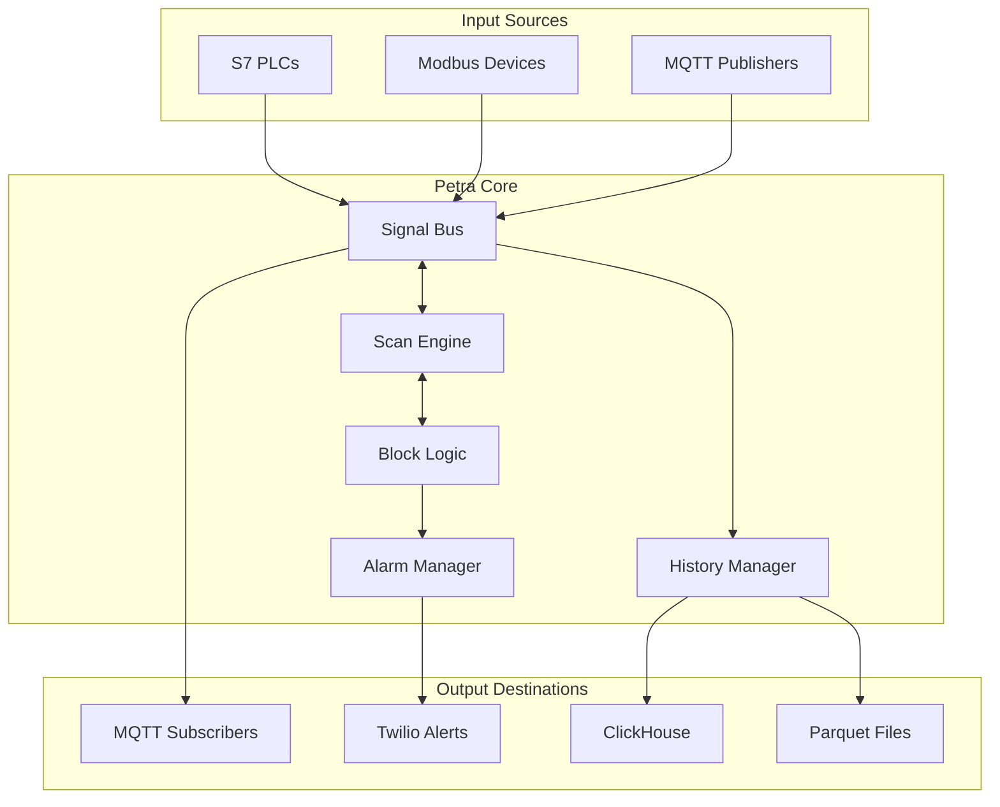

Below is a clean, ready-to-paste *Markdown file* — there’s **no extra wrapping code-block**, and the Mermaid diagram is fully closed so GitHub can render it without errors.

---

# Petra System Architecture

## Overview

Petra follows a **modular, event-driven** architecture built for reliability, performance, and extensibility.

---

## Core Components

| # | Component         | Highlights                                                                                 |
| - | ----------------- | ------------------------------------------------------------------------------------------ |
| 1 | **Signal Bus**    | Central “nervous system” • Thread-safe concurrent access • Event-driven • Hot-path caching |
| 2 | **Scan Engine**   | Deterministic cycles (1 ms – 1 s) • Jitter monitoring/compensation • Priority scheduling   |
| 3 | **Block System**  | 15 + built-in blocks • Modular & hot-swappable • Custom block SDK                          |
| 4 | **Storage Layer** | Multi-tier WAL → remote persistence • Fail-over • Compression & archival                   |

---

## Data Flow

### 1 ▪ Input Stage

* Protocol drivers read from field devices.
* Data validated, typed, and written to the **Signal Bus**.

### 2 ▪ Processing Stage

* **Scan Engine** triggers block execution on its deterministic cycle.
* Blocks pull inputs from the bus, evaluate logic, and push outputs back.

### 3 ▪ Output Stage

* MQTT publishers emit signal changes.
* **History Manager** persists samples.
* **Alarm Manager** evaluates conditions and triggers actions (SMS, etc.).

---

## Concurrency Model

* **Single scan thread** → deterministic logic execution.
* **Async I/O** (Tokio) for all protocol drivers.
* **Lock-free Signal Bus** (DashMap) enables low-latency access.
* **Buffered channels** decouple components and absorb back-pressure.

---

## Reliability Features

* Automatic reconnection for all protocol drivers.
* Local WAL buffers data during outages.
* Graceful degradation with partial connectivity.
* Built-in health checks & metrics endpoints.

---

## Performance Characteristics

| Metric                 | Target      | Typical    |
| ---------------------- | ----------- | ---------- |
| Scan Time              | 10 – 100 ms | ≈ 50 ms    |
| Scan Jitter            | < 10 %      | < 5 %      |
| Signal Throughput      | 100 k / s   | ≈ 50 k / s |
| MQTT Messages          | 10 k / s    | ≈ 5 k / s  |
| Memory per 1 k signals | 100 MB      | ≈ 50 MB    |

---

## Security Architecture

* **Authentication** required for every connection.
* **RBAC** authorization model.
* **TLS** encryption on all network links.
* **Audit logging** with user context.
* Rigorous **input validation & sanitization** at every boundary.
