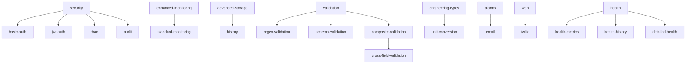

# PETRA Feature Flags Guide

## Quick Start

Choose a bundle based on your use case:

```bash
# Edge Device (minimal footprint)
cargo build --features edge

# SCADA System (industrial automation)
cargo build --features scada

# Production Server (reliable, optimized)
cargo build --features production

# Enterprise (full-featured)
cargo build --features enterprise

# Development (all features for testing)
cargo build --features development
```

## Feature Organization

PETRA organizes its 80+ feature flags into logical groups for easier management and understanding.

### Core Features

| Feature | Description | Dependencies |
|---------|-------------|--------------|
| `standard-monitoring` | Basic monitoring capabilities | None |
| `enhanced-monitoring` | Advanced monitoring with detailed stats | `standard-monitoring` |
| `optimized` | Performance optimizations (parking_lot, faster algorithms) | None |
| `metrics` | Prometheus metrics integration | None |
| `realtime` | Real-time OS scheduling support (Linux only) | None |

**Choose one monitoring level:**
- Use `standard-monitoring` for basic deployments
- Use `enhanced-monitoring` for detailed performance analysis

### Protocol Features

| Feature | Description | Use Case |
|---------|-------------|----------|
| `mqtt` | MQTT protocol support | IoT, edge devices |
| `s7-support` | Siemens S7 PLC communication | Industrial automation |
| `modbus-support` | Modbus TCP/RTU drivers | Industrial automation |
| `opcua-support` | OPC-UA server implementation | Standards compliance |

**Feature Groups:**
- `industrial` = `s7-support` + `modbus-support` + `opcua-support`
- `iot` = `mqtt`

### Storage Features

| Feature | Description | Use Case |
|---------|-------------|----------|
| `history` | Parquet-based historical data logging | Basic data retention |
| `advanced-storage` | ClickHouse, S3, RocksDB backends | Enterprise deployments |
| `compression` | Data compression (zstd, lz4) | Reduced storage costs |
| `wal` | Write-Ahead Logging | Data durability |

**Feature Groups:**
- `basic-storage` = `history`
- `enterprise-storage` = `advanced-storage` + `compression` + `wal`

### Security Features

| Feature | Description | Dependencies |
|---------|-------------|--------------|
| `security` | Base security framework | None |
| `basic-auth` | Basic authentication | `security` |
| `jwt-auth` | JWT authentication | `security` |
| `rbac` | Role-based access control | `security` |
| `audit` | Security audit logging | `security` |

**Feature Groups:**
- `basic-security` = `security` + `basic-auth`
- `enterprise-security` = `basic-security` + `jwt-auth` + `rbac` + `audit`

### Type System Features

| Feature | Description | Use Case |
|---------|-------------|----------|
| `extended-types` | String, Binary, Timestamp, Array, Object types | Complex data structures |
| `engineering-types` | Engineering units support | Process control |
| `quality-codes` | OPC-style quality codes | Standards compliance |
| `value-arithmetic` | Arithmetic operations on values | Calculations |
| `unit-conversion` | Unit conversion support | Multi-unit systems |

### Validation Features

| Feature | Description | Dependencies |
|---------|-------------|--------------|
| `validation` | Base validation framework | None |
| `regex-validation` | Regex pattern validation | `validation` |
| `schema-validation` | JSON schema validation | `validation` |
| `composite-validation` | Complex validation scenarios | `validation` |
| `cross-field-validation` | Cross-field validation rules | `composite-validation` |

### Alarm & Notification Features

| Feature | Description | Dependencies |
|---------|-------------|--------------|
| `alarms` | Alarm management system | None |
| `email` | Email notifications | `alarms` |
| `twilio` | SMS/Voice alerts via Twilio | `alarms`, `web` |

### Web & Health Features

| Feature | Description | Use Case |
|---------|-------------|----------|
| `web` | Web interface and REST API | Remote management |
| `health` | System health monitoring | Operations |
| `detailed-health` | Enhanced health metrics | Detailed monitoring |
| `health-metrics` | Health metrics integration | Observability |
| `health-history` | Health data retention | Historical analysis |

### Development Features

| Feature | Description | Use Case |
|---------|-------------|----------|
| `examples` | Example applications | Learning, testing |
| `burn-in` | Burn-in testing utilities | Quality assurance |
| `gui` | Configuration GUI (egui) | Visual configuration |
| `profiling` | Performance profiling | Optimization |
| `json-schema` | Schema generation | API documentation |

## Feature Bundles

### Edge Device Bundle
```bash
cargo build --features edge
```

**Includes:**
- `mqtt` - IoT connectivity
- `standard-monitoring` - Basic monitoring
- `compression` - Efficient storage
- `basic-validation` - Input validation

**Use case:** IoT edge devices, minimal footprint deployments

**Binary size:** ~15MB (optimized)

### SCADA System Bundle
```bash
cargo build --features scada
```

**Includes:**
- `industrial` - All industrial protocols
- `enhanced-monitoring` - Detailed monitoring
- `enterprise-storage` - Full storage stack
- `basic-security` - Authentication
- `basic-alarms` - Alarm notifications
- `basic-web` - Web interface

**Use case:** Industrial automation, HMI systems

**Binary size:** ~45MB (optimized)

### Production Server Bundle
```bash
cargo build --features production
```

**Includes:**
- `optimized` - Performance optimizations
- `standard-monitoring` - Monitoring
- `metrics` - Prometheus integration
- `basic-security` - Security
- `wal` - Data durability
- `history` - Data logging
- `basic-web` - Management interface

**Use case:** Reliable production deployments

**Binary size:** ~25MB (optimized)

### Enterprise Bundle
```bash
cargo build --features enterprise
```

**Includes:**
- All production features
- `enhanced-monitoring` - Advanced monitoring
- `enterprise-security` - Full security stack
- `enterprise-storage` - Full storage options
- `full-alarms` - All notification methods
- `full-web` - Complete web features
- `enhanced-types` - Extended type system

**Use case:** Large-scale enterprise deployments

**Binary size:** ~65MB (optimized)

### Development Bundle
```bash
cargo build --features development
```

**Includes:**
- Most features for comprehensive testing
- `full-dev` - All development tools
- GUI and profiling tools

**Use case:** Development and testing

**Binary size:** ~85MB (debug)

## Feature Dependencies



## Feature Compatibility Matrix

| Feature | Compatible With | Incompatible With | Notes |
|---------|----------------|-------------------|-------|
| `standard-monitoring` | All features | `enhanced-monitoring` | Choose one monitoring level |
| `enhanced-monitoring` | All features | `standard-monitoring` | Choose one monitoring level |
| `optimized` | All features | None | Recommended for production |
| `mqtt` | All features | None | No conflicts |
| `s7-support` | All protocols | None | Platform requirements apply |
| `realtime` | All features | None | Linux only |

## Platform-Specific Notes

### Linux
- All features supported
- `realtime` feature provides RT scheduling
- Recommended for production deployments

### Windows
- Most features supported
- `s7-support` requires snap7.dll in PATH
- `realtime` feature not available

### macOS
- Most features supported
- `s7-support` requires libsnap7.dylib
- Some industrial features may have limitations

## Migration Guide

### From Scattered Features to Organized Bundles

**Before:**
```toml
features = [
    "enhanced-monitoring", 
    "mqtt", 
    "s7-support", 
    "history", 
    "security", 
    "jwt-auth",
    "alarms",
    "email",
    "web"
]
```

**After:**
```toml
features = ["scada", "jwt-auth"]
```

### Step-by-Step Migration

1. **Identify your current feature set:**
   ```bash
   grep -r "feature =" Cargo.toml
   ```

2. **Find the appropriate bundle:**
   - IoT/Edge → `edge`
   - Industrial → `scada`
   - Server → `production`
   - Full-featured → `enterprise`

3. **Update Cargo.toml:**
   ```toml
   [features]
   default = ["edge"]  # or your chosen bundle
   ```

4. **Add specific features if needed:**
   ```toml
   [features]
   default = ["production", "jwt-auth", "twilio"]
   ```

5. **Test the new configuration:**
   ```bash
   cargo build --features production
   cargo test --features production
   ```

### Breaking Changes

- Monitoring features are now mutually exclusive
- Some feature names have been reorganized
- Bundle features include dependencies automatically

### Compatibility

The new system maintains backward compatibility:
- Individual features still work
- Legacy feature combinations are preserved
- Existing code should compile without changes

## Build Examples

### Common Combinations

```bash
# IoT edge device with security
cargo build --features "edge,security"

# SCADA with JWT authentication
cargo build --features "scada,jwt-auth"

# Production server with all protocols
cargo build --features "production,mqtt,industrial"

# Development with GUI
cargo build --features "development,gui"

# Minimal security-focused build
cargo build --features "mqtt,enterprise-security"
```

### Custom Feature Sets

```bash
# Custom combination
cargo build --features "mqtt,history,security,alarms,web"

# Protocol-specific build
cargo build --features "s7-support,modbus-support,basic-security"

# Storage-focused build
cargo build --features "mqtt,enterprise-storage,metrics"
```

## Performance Impact

### Binary Size Comparison

| Configuration | Debug Size | Release Size | Features |
|---------------|------------|--------------|----------|
| Minimal | 8MB | 4MB | Core only |
| Edge | 25MB | 15MB | MQTT + monitoring |
| Production | 40MB | 25MB | Optimized + security |
| SCADA | 65MB | 45MB | All protocols |
| Enterprise | 95MB | 65MB | All features |

### Runtime Performance

- `optimized` feature: 15-20% performance improvement
- `enhanced-monitoring`: 2-5% overhead
- `metrics` feature: <1% overhead
- Protocol features: No overhead when not used

## Troubleshooting

### Common Issues

**"Feature validation failed"**
```bash
# Check for conflicting features
cargo build --features "standard-monitoring,enhanced-monitoring"
# Error: Only one monitoring level allowed
```

**"Missing required dependency"**
```bash
# Add required dependencies
cargo build --features "jwt-auth"  # Requires security
# Fix: cargo build --features "security,jwt-auth"
```

**"Platform not supported"**
```bash
# Check platform-specific features
cargo build --features "realtime"  # Linux only
```

### Debug Feature Detection

```rust
use petra::Features;

fn main() {
    let features = Features::detect();
    features.print();
    println!("Summary: {}", features.summary());
}
```

### Validate Configuration

```rust
use petra::Config;

fn main() -> Result<(), Box<dyn std::error::Error>> {
    let config = Config::from_file("config.yaml")?;
    println!("Features: {}", config.feature_summary());
    Ok(())
}
```

## Best Practices

### Feature Selection

1. **Start with bundles** - Use predefined bundles for common use cases
2. **Add specific features** - Only add individual features when needed
3. **Test combinations** - Verify feature combinations work together
4. **Consider binary size** - Balance features vs. deployment size

### Development Workflow

1. **Use development bundle** for full testing
2. **Test target bundle** before deployment
3. **Validate configurations** with target features
4. **Monitor performance** impact of feature choices

### Production Deployment

1. **Use production/enterprise bundles** for reliability
2. **Enable monitoring and metrics** for observability
3. **Include security features** for protection
4. **Test feature combinations** in staging environment

## Future Roadmap

### Planned Features

- **Machine Learning**: `ml-inference`, `ml-training`
- **Cloud Integration**: `aws`, `azure`, `gcp`
- **Advanced Analytics**: `time-series`, `forecasting`
- **Container Orchestration**: `kubernetes`, `docker-swarm`

### Bundle Evolution

- **Cloud Bundle**: Cloud-native deployments
- **AI Bundle**: ML and analytics features
- **Micro Bundle**: Ultra-minimal edge deployment

## Support

### Getting Help

- **Documentation**: [docs.petra.systems](https://docs.petra.systems)
- **GitHub Issues**: Bug reports and feature requests
- **Discord**: Community support and discussion
- **Enterprise Support**: Commercial support available

### Contributing

See [CONTRIBUTING.md](../CONTRIBUTING.md) for information on:
- Adding new features
- Testing feature combinations
- Documentation updates
- Feature flag best practices

---

*Last updated: December 2024*
